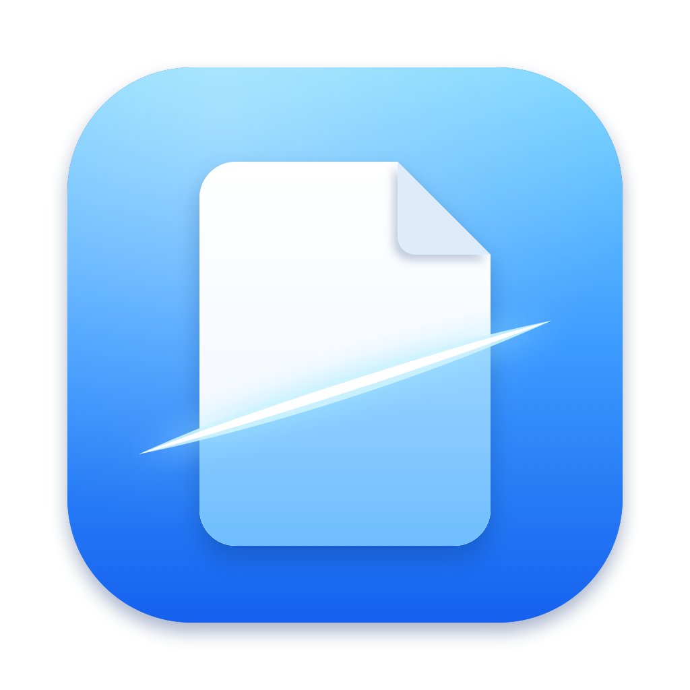

  

# ClipSeal

Extract documents from `.p7m` files, right from your macOS menu bar. Copy an attachment in Mail, Outlook, or Finder and ClipSeal makes the contained documents available to open, save, preview, or drag into another app.

## Downloads

Official installers and version notes will be published on the [Releases page](https://github.com/mevodo-tools/clipseal-releases/releases). The first public release is being prepared.

## Installation

1. Download the DMG attached to a release.
2. Open the DMG and drag ClipSeal into Applications.
3. Launch ClipSeal from Applications.

Requires **macOS 15.4 or later**.

## About this repository

This repository distributes ClipSeal downloads and release notes. The application source code is maintained separately and is not included here.

Part of [Mevodo Tools](https://github.com/mevodo-tools).
